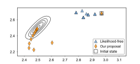
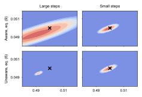

# Differentiable Likelihoods for Fast Inversion of 'Likelihood-free' Dynamical Systems

This repository contains the python code that was used for the paper

[1] Kersting, H., Krämer, N., Schiegg, M., Daniel, C., Tiemann, M., and Hennig, P.  **Differentiable likelihoods for fast inversion of ‘likelihood-free’ dynamical systems.** In: Proceedings of the 37th International Conference on Machine Learning, Online, PMLR 119, 2020.**

and some related methods.


<p align="center">

</p>


## Contents

Linear state space models, Kalman filter, probabilistic solvers for ODEs,  Markov Chain Monte Carlo simulation and more.
The focus is on those methods that were introduced/used in the aforementioned paper.


## Installation
In the root directory, run
```
pip install .
```

## Requirements

numpy, scipy, matplotlib, dataclasses

## Example
Below is a code snippet that applies a probabilistic ODE solver to an initial value problem based on a linear ODE.
```python
from difflikelihoods import statespace
from difflikelihoods import odesolver
from difflikelihoods import ode
ibm = statespace.IBM(q=2, dim=1)
lin_ode = ode.LinearODE(t0=0.1, tmax=2.0, params=2.1, initval=0.9)
solver = odesolver.ODESolver(ibm, filtertype="kalman")
tsteps, means, stdevs = solver.solve(lin_ode, stepsize=0.01)
```
More examples are contained in the ```examples``` directory.

## Experiments

The experiments from the paper are in the ```experiments``` folder and sorted as `FigureN.ipynb`. For example, the notebook for Figure 3 can be found in `./experiments/Figure3.ipynb`.
If you want to apply this algorithm to your own problems, those notebooks might be good starting points/tutorials.

## Cite as

Please cite this work as
```
@article{kersting2020differentiable,
  title={Differentiable Likelihoods for Fast Inversion of 'Likelihood-Free' Dynamical Systems},
  author={Kersting, Hans and Kr{\"a}mer, Nicholas and Schiegg, Martin and Daniel, Christian and Tiemann, Michael and Hennig, Philipp},
  journal={Proceedings of the 37th International Conference on Machine Learning, Online, PMLR 119},
  year={2020}
}

```
